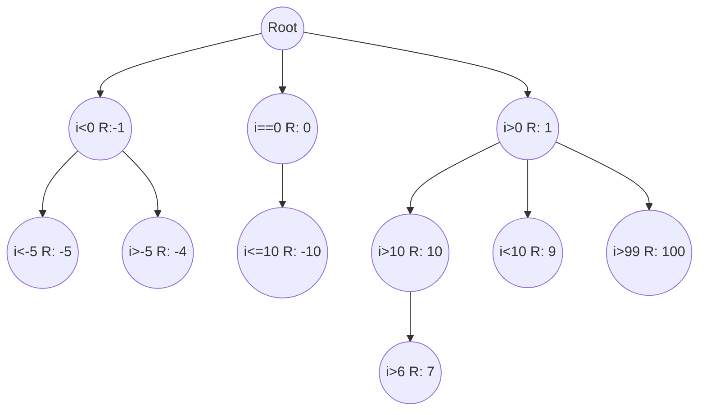

# choose-it

[](https://github.com/Eomm/choose-it/actions)
[](https://standardjs.com)
[](https://packagephobia.now.sh/result?p=choose-it)

This module let you focus on the business logic instead of going crazy in a `if/else` jungle 🌴🐵🌴🌴

It implements a generic tree where each node is a `Criteria` and you can attach optionally a `Resouce`.
When you need the resource, you will evaluate the tree criterias and if the criteria return `true`
the resource is returned. You can build a series of `Criteria` with many branches as you want!

An example use case is when you have a set of databases connections that are not configured as cluster,
and you have to choose one base on some filters, or simply there are settings you need to use
based on some boolean of your company crazy configuration!

In these cases you have to write always the same `if/else` conditions to pick one of those resources.

`choose-it` will solve this problem: build the tree, grab the resource 🎉



*This tree is built in our tests!


## Installation

```
npm install choose-it
```


## Usage

```js
const ChooseIt = require('choose-it')

const exampleConfig = {
  admin: {
    viewAll: true
  },
  external: {
    viewAll: false,
    login: 'http://external.login.log'
  },
  guest: {
    viewAll: false,
    login: 'http://login.log'
  }
}

const resouceChooser = new ChooseIt()

// Optionally, assign a "resource" to a Criteria
resouceChooser.addCriteria((item) => item.admin === true, exampleConfig.admin)

// You can chain the Criteria to build sub-conditions
resouceChooser.addCriteria((item) => item.guest === true, exampleConfig.guest)
  .addCriteria((item) => item.external === true, exampleConfig.external)

// Assign a node to a variable to use it later
const myNode = resouceChooser.addCriteria((item) => item.power === false, { noPower: true })

// Add a sibling node. You can't call this method on the root node!
myNode.addSiblingCriteria((item) => item.power === true, { gotThePower: true })

// View your tree
resouceChooser.prettyPrint()
// function noop () { return true }
// ├── (item) => item.admin === true [object Object]
// ├─┬ (item) => item.guest === true [object Object]
// │ └── (item) => item.external === true [object Object]
// ├── (item) => item.power === false [object Object]
// └── (item) => item.power === true [object Object]

// View your tree with a custom output
resouceChooser.prettyPrint((criteria, resource = '') => `${criteria.toString()} = Resource [${resource.viewAll}]`)
// function noop () { return true } = Resource [undefined]
// ├── (item) => item.admin === true = Resource [true]
// ├─┬ (item) => item.guest === true = Resource [false]
// │ └── (item) => item.external === true = Resource [false]
// ├── (item) => item.power === false = Resource [undefined]
// └── (item) => item.power === true = Resource [undefined]

const user = {
  guest: true,
  external: true
}

const res = resouceChooser.evaluate(user)
console.log(res)
/** It will print out:
 [
    { viewAll: false, login: 'http://login.log' },
    { viewAll: false, login: 'http://external.login.log' }
  ]
*/

const needOnlyOne = resouceChooser.evaluate(user, { maxResults: 1 })
console.log(needOnlyOne)
/** It will print out:
 * [ { viewAll: false, login: 'http://login.log' } ]
 */

```


# API

You have seen all the API in action in the "Usage" paragraph.

We need only to go deeper on `evaluate` options 👍

| Option | Default | Description |
|--------|---------|-------------|
| `traverseAll` | `false` | If you have a branch like `C1-->C2-->C3` if `traverseAll` is true, even if C2 fail, C3 will be evaluated and could return its resource (if it will be valid criteria of course). `traverseAll = false` will stop the execution of the branch whenever a falsy criteria is found |
| `maxResults` | 0 | Limit the output length. 0 means "no limit" |
| `algorithm` | `BFS` | You can choose between two main traverse tree algorithm: Breadth First-Search and Depth First-Search |
| `order` | `NLR` | This param set the Depth First-Search to be Pre-Order (NLR) or Post-Order (LRN). The `traverseAll` parameter is ignored by the Post-Order traversal |

Copy-Paste default options:

```js
{
  traverseAll: false,
  maxResults: 0, // 0 = disabled
  algorithm: 'BFS', // [BFS, DFS]
  order: 'NLR' // [NLR, LRN]
}
```


## Roadmap

- [ ] Emit events `onAdd`, `onFind`, `onMax`, `onEnd`
- [ ] Manage Promise in Criteria
- [ ] Performance assessment


## License

Copyright [Manuel Spigolon](https://github.com/Eomm), Licensed under [MIT](./LICENSE).
